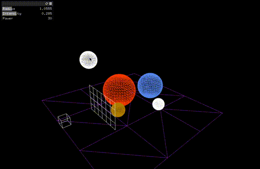
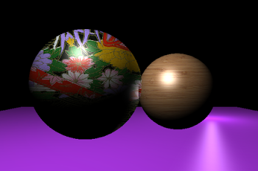

# rayTracer
A 3D renderer implementing ray tracing in openFrameworks.

## About
I worked on this in fall of 2018 when I was taking an undergrad computer graphics course. For my final project, I expanded on the preliminary ray tracer we were assigned to write as homework.

Features I implemented include interactivity with the scene, antialiasing via stratified sampling, and texture mapping via tiling.

Two years later, as I am writing this, there are issues porting the project to my current OS and the latest version of openFrameworks. 
I've managed to resolve some, but at the moment, renderering crashes the application.

## To-do
- Figure out why rendering no longer works lol
- Eliminate moiré patterns that arose during antialiasing (resample?)
- Make textures configurable and map more realistically

## Installation
### OSX
Clone this project. You should be able to simply open and run it in XCode.

## How to use it
- Camera controls
  - Zoom in and out with the mouse wheel
  - Hold the left mouse-button as you move the mouse to change viewing angle
  - Hold `alt` as you hold the left mouse-button and move the mouse to pan
- Press `c` to disable camera controls and interact with objects instead
  - Select an object by left-clicking it
  - Press `d` to delete it
  - Press `s` to create a new sphere
  - Press `l` to create a new light
  - Use the sliders in the upper-left GUI to configure parameters of a selected object
- Press `r` to output an image of your scene. You will find it in the bin/ directory when it is done.

### Example output

